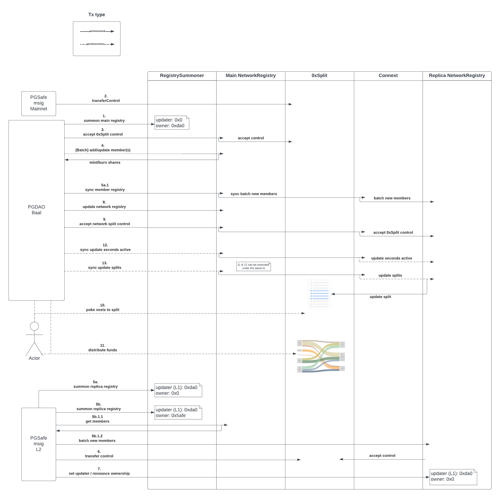

# Documentation

## Background: Protocol Guild's V1 Architecture

For Protocol Guild's 1-year pilot, the
[smart contract architecture](https://protocol-guild.readthedocs.io/en/latest/3-smart-contract.html) used
[0xSplits](https://docs.0xsplits.xyz/) to manage all funds, including both the vesting of donated funds and distribution
of vested funds to members:

1. **Donations**
   - Anyone can send ETH and ERC-20 tokens to the Guild's
     [Vesting contract address](https://app.0xsplits.xyz/accounts/0xF29Ff96aaEa6C9A1fBa851f74737f3c069d4f1a9/) on
     mainnet.
     - NFT donations are not supported - standard NFT transfers (safeTransfer) will be rejected by the contract, i.e.
       will cause the transaction to fail. Non-safeTransfer NFT donations will be lost.
     - Funds donated on L2s were bridged over to mainnet.
2. **Vesting**
   - Whenever funds are added to the 0xSplits Vesting contract, a "stream" needs to be started to begin the vesting
     process.
     - Starting a stream is permissionless.
     - Any funds donated during the pilot vest over 1 year (from the point the stream is started).
3. **Distributions**
   - Donated funds which are vested need to be "released" in 0xSplits. Releasing vested funds pushes them to the Guild's
     [Split contract](https://app.0xsplits.xyz/accounts/0x84af3D5824F0390b9510440B6ABB5CC02BB68ea1/)
     - Releasing funds is permissionless.
   - To withdraw funds released into the Split contract, 0xSplits first requires to "Distribute" the funds (among all
     the Split's recipients), at which point the Split's recipients can "Withdraw" the funds.
     - There is a function to "Withdraw for myself" and "Withdraw for all".
     - Distribute and withdraw functions can be done separately, or combined into one transaction. Again both functions
       are permissionless.

**Managing 0xSplits**

While the Guild's Vesting contract is immutable, the Split contract can be updated by the Guild's 6/10
[Safe multisig](https://app.safe.global/transactions/history?safe=eth:0xF6CBDd6Ea6EC3C4359e33de0Ac823701Cc56C6c4). The
multisig can be used to add / remove members from the Split contract, and change the % allocation to members. The %
allocation is determined by a
[weighting formula](https://protocol-guild.readthedocs.io/en/latest/6-operating-guidelines.html#weighting):

_= SQRT((eligibleMonths - monthsOnBreak) \* timeWeighting)_

The "timeWeighting" multiplier is 0.5 for part time contributors, and 1 for full time contributors. The goal of the
weighting formula is to reduce the total variance range of every member weight (hence using a square root).

**Updating** the Split contract is a manual process. The membership list is kept in an offchain, permissioned Airtable
using formulas to keep track of the weighting, based on member start dates and status (full time / part time). Updates
to the membership are made quarterly. To update the Split contract, the multisig is used to import a CSV from the
Airtable into the Split contract, which updates member addresses and their weights.

If someone is **removed** from the Split contract, they still have access to the funds distributed to them before being
removed. But they will not receive any future vested funds.

If someone new is **added** to the Split contract, they will be eligible for their share of vested funds distributed
from that point onward (i.e. will not have a claim on previously distributed funds).

## PG NetworkRegistry Sequence Diagram

